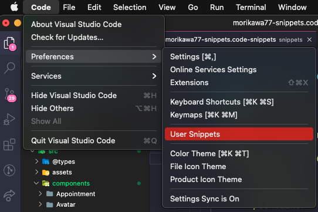

<h3>VS Code Snippets</h3>

Go to Code menu > Preferences > User Snippets

Choose a language for your snippets or create a new one ( you can create for your actual project or a global).

Use the Snippet Generator website do generate the snippet json:
https://snippet-generator.app

